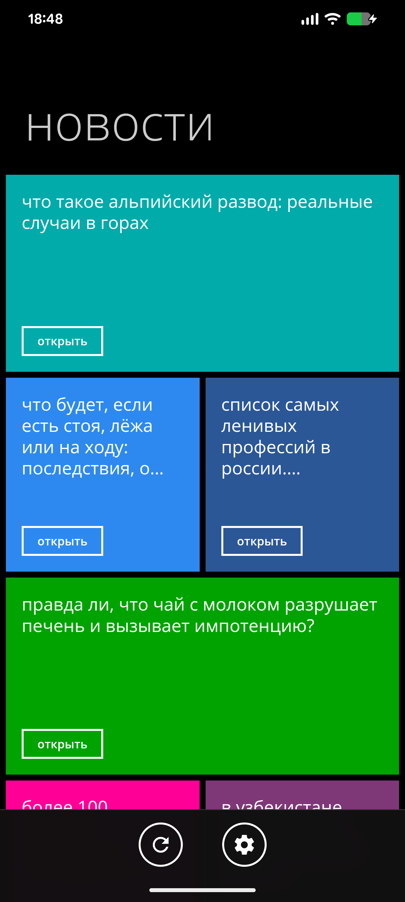
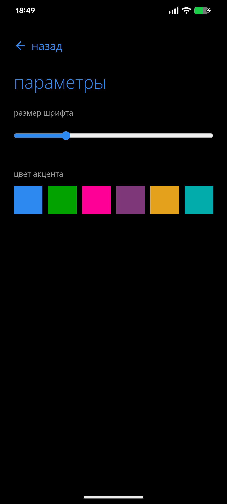
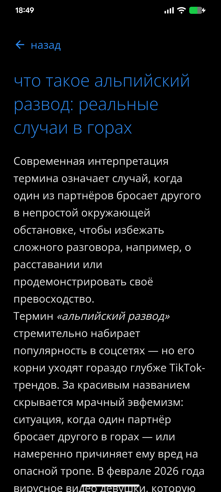

# 
MetroNews

  
  
  

  <b>Новости основанные на Hi-news RSS, вдохновлен windows 8.1 и windows phone, крута</b> 
  

---

## Скриншоты

  
  
  

---

> ### особенности
> **Нет мусора:** В новостях нет рекламы, ссылок и всякого другого мусора.                               
> **Персонализация:** Есть настройка цвета акцента и размера шрифта
---
